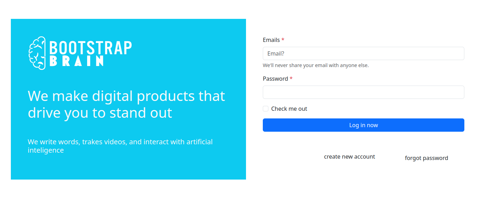

# Log In 
Bootstrap es un framework que permite a los desarrolladores web construir páginas web responsives de una forma más rápida y sencilla. En este sentido, proporciona un conjunto de componentes y plantillas CSS, HTML y JavaScript que cualquiera puede utilizar o modificar de manera gratuita.
